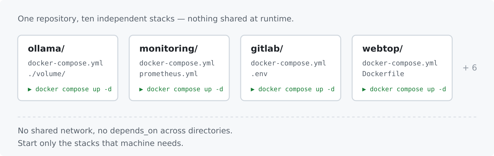
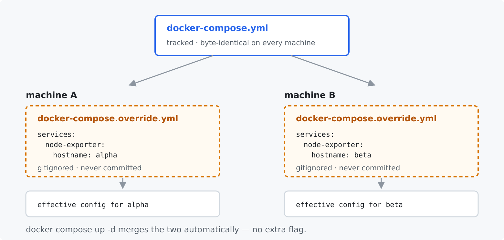
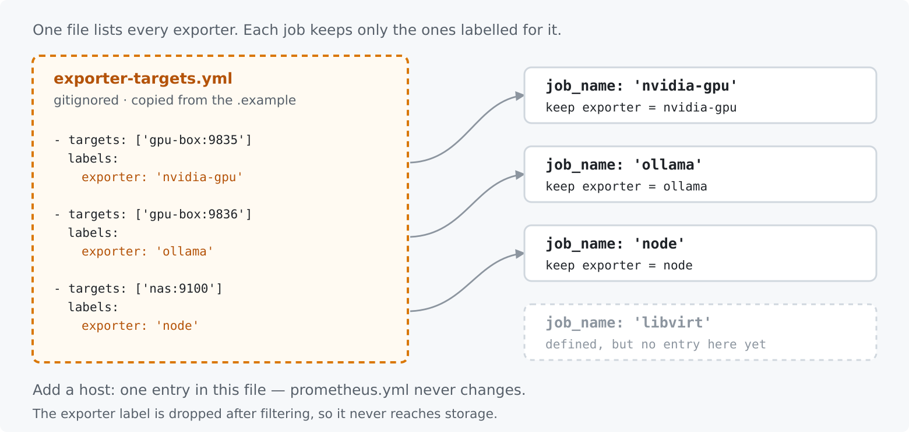

# Homelab Docker Compose Stacks

Ten Docker Compose stacks for a personal homelab: local LLM serving, a Prometheus and Grafana
monitoring stack, browser-based Linux desktops, and a couple of developer tools.

Running any one of them is a solved problem: make a directory, write a `docker-compose.yml`, run
`docker compose up -d`. Keep the directories in one git repository and you have the whole lab
described in files you can read and roll back.

Then you clone that repository onto a second machine. This one has two GPUs instead of one, a
different hostname, models on a NAS instead of a local disk. So you edit the compose file, and
the repository stops working as a repository. The edit dirties a tracked file, so `git pull`
conflicts; but the edit is true of one machine only, so you can't commit it away either. Every
lab that grows past one host arrives here, and the usual escape is to fork the compose file per
machine, which rots quietly until the two copies do different things for reasons nobody recorded.

Here, no `docker-compose.yml` contains anything specific to a machine. Whatever is true of one
host only lives in a `docker-compose.override.yml` that is gitignored and that Compose merges
automatically. The tracked files stay identical everywhere, so `git pull` is always clean.

## 1. One directory is one complete stack



Every directory is a whole stack and starts on its own. There is no root compose file, no shared
network, and no `depends_on` reaching across directories, so a machine runs only the stacks it
needs, and a broken stack cannot take a neighbour down.

The stacks do cooperate, but only through configuration you write by hand: the monitoring stack
scrapes the exporters by address (key point 3), not through Compose.

## 2. The compose file is host-agnostic; your machine's settings are an override



```bash
cd <stack>
cp docker-compose.override.example.yml docker-compose.override.yml
$EDITOR docker-compose.override.yml
docker compose up -d      # merges both files; no extra flag
```

Every stack ships a `docker-compose.override.example.yml` listing the overrides that stack
actually tends to need. `docker-compose.override.yml` is gitignored repository-wide.

Three merge rules decide where a value belongs:

| Field | On merge |
|-------|----------|
| `volumes`, `devices`, `ports` | appended to the base list |
| `environment`, `labels` | merged per key; the override wins |
| `command`, `hostname`, `runtime` | replaced outright |

Because lists append, the tracked file carries the *minimum that works anywhere* and the
override adds to it. To replace a list rather than extend it, tag it `!override`; to drop it
entirely, `!reset []`.

Secrets and per-host URLs stay in `.env`, as before; each stack that needs one ships a
`.env.example`.

## 3. One targets file feeds every scrape job



`monitoring/prometheus.yml` defines six jobs, and four of them read the *same* file,
`exporter-targets.yml`, through `file_sd_configs`. Each entry in that file carries an `exporter:`
label, and each job keeps only the entries matching its own name, then drops the label so it never
reaches storage.

Adding a host to the lab is therefore one entry in one gitignored file. `prometheus.yml` is
tracked and does not change.

```bash
cd monitoring
cp exporter-targets.example.yml exporter-targets.yml
```

The `libvirt` job is defined but has no exporter in this repository; point it at a libvirt
exporter running elsewhere, or leave it with no targets. The `cadvisor` job is the exception to
the pattern: it scrapes the local container directly at `host.docker.internal:18081`.

## Stacks

| Directory | Ports (host) | GPU | What it is |
|-----------|--------------|-----|------------|
| `ollama/` | 11434 | yes | Official Ollama LLM server |
| `ollama37/` | 11434 | yes | Custom Ollama build — **conflicts with `ollama/`** |
| `open-webui/` | 8080 | yes | Browser front-end for chatting with models |
| `webtop/` | 3000 (`WEBTOP_PORT`) | optional | Linux desktop in a browser; built locally |
| `monitoring/` | 13000, 19090, 19100, 18081 | no | Grafana, Prometheus, Node Exporter, cAdvisor |
| `host-exporters/` | 9100, 8081 | no | Node Exporter + cAdvisor alone, for a remote host |
| `gpu-exporter/` | 9835 | yes | NVIDIA GPU metrics |
| `ollama-exporter/` | 9836 | no | VRAM per loaded Ollama model; built locally |
| `gitlab/` | 8929, 2222 | no | GitLab CE + Runner |
| `mcp-atlassian/` | 9000 | no | MCP server bridging Jira and Confluence |

`webtop/` takes its GPU from `DOCKER_RUNTIME` in `.env`; the other GPU stacks set
`runtime: nvidia` directly.

## Getting started

You need Docker with the Compose plugin. Stacks marked GPU also need the NVIDIA Container
Toolkit. Check it is registered with:

```bash
docker info --format '{{json .Runtimes}}' | grep -q nvidia && echo present
```

Then, for any stack:

```bash
cd <stack>
cp .env.example .env                                  # only where one exists
cp docker-compose.override.example.yml docker-compose.override.yml   # if you need per-host changes
docker compose up -d
docker compose logs -f
```

`gpu-exporter/`, `monitoring/` and `webtop/` also have a `Makefile`; run `make help` in those.
`monitoring/` needs `make setup` on a first run: it creates the volume directories with the UIDs
Prometheus (65534) and Grafana (472) expect.

Files you must create yourself, all gitignored:

| File | Stack | Holds |
|------|-------|-------|
| `.env` | `gitlab/`, `mcp-atlassian/`, `monitoring/`, `webtop/` | secrets and per-host URLs |
| `exporter-targets.yml` | `monitoring/` | the exporters to scrape |
| `docker-compose.override.yml` | any | this machine's compose settings |

## Per-stack documentation

Three stacks carry their own README, which is the source of truth for that stack:

- [`monitoring/README.md`](monitoring/README.md) — dashboards, volume permissions, cAdvisor
  networking
- [`gpu-exporter/README.md`](gpu-exporter/README.md) — the metrics it exposes
- [`webtop/README.md`](webtop/README.md) — desktop image and auth

Grafana dashboards arrive two ways. Files in `monitoring/provisioning/dashboards/`
(`nvidia-gpu.json`, `opnsense.json`) are copied into the Grafana volume by `make seed-dashboards`.
Community dashboards 1860 (Node Exporter Full) and 14282 (Cadvisor exporter) are pulled from
grafana.com by `make import-dashboards`, which **overwrites** them on every run; see the warning
at the top of `monitoring/import-dashboards.sh` before re-running it.

## Conventions

- **Timezone** — `TZ=Asia/Taipei` on every container
- **Restart policy** — `unless-stopped` on every service
- **Storage** — each stack keeps state in its own `./volume/`, gitignored
- **Host-specific values** — never in a tracked file; see key point 2
- **Comments** — compose files carry the *reason* for a non-obvious setting, not a restatement of
  the line

## Diagrams

The diagrams above are SVG sources in `docs/diagrams/`, rendered to PNG by a committed script:

```bash
./docs/diagrams/render.sh      # needs librsvg (rsvg-convert)
```

Edit the SVG, re-run the script, commit both.
