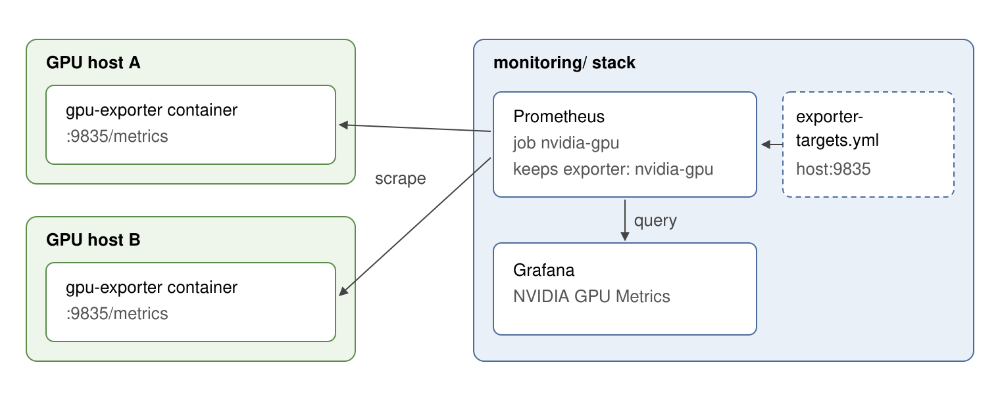
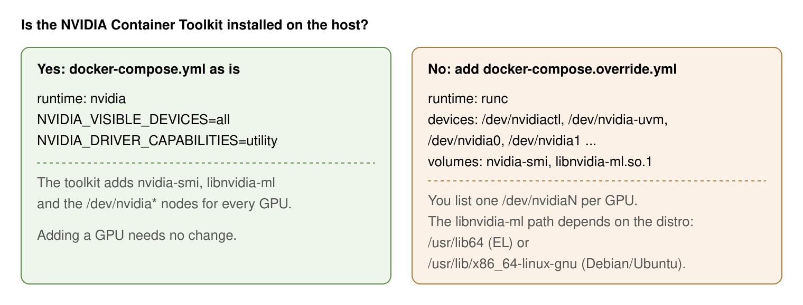
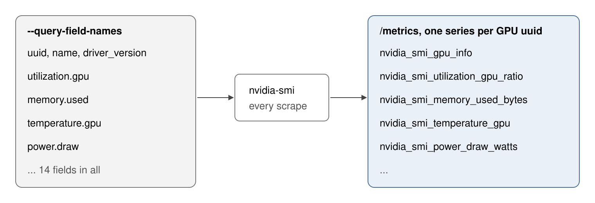

# GPU Exporter

The `monitoring/` stack's Prometheus scrapes exporters on other hosts and shows their metrics in Grafana. GPU utilization, memory, temperature and power are different: only the host's NVIDIA driver knows them, and you read them with `nvidia-smi`. Prometheus has no endpoint to scrape for them, and a container can't reach the driver on its own. This directory runs [nvidia_gpu_exporter](https://github.com/utkuozdemir/nvidia_gpu_exporter) on each GPU host. On every scrape it runs `nvidia-smi` and serves the result as `nvidia_smi_*` metrics on port `9835`.

The host needs the NVIDIA driver, and either the NVIDIA Container Toolkit or the override in point 2.

```bash
make up     # start the exporter
make test   # print the first metrics from http://localhost:9835/metrics
```

```
nvidia_smi_clocks_current_graphics_clock_hz{uuid="<gpu-uuid>"} 2.1e+08
nvidia_smi_clocks_current_memory_clock_hz{uuid="<gpu-uuid>"} 4.05e+08
...
```

## 1. Each GPU host runs one exporter, and the central Prometheus scrapes them all



The exporter only serves metrics. Scraping, storage and dashboards stay in `monitoring/`. To add a GPU host, start the exporter there, then add a target to `monitoring/exporter-targets.yml`:

```yaml
- targets:
    - '<gpu-host>:9835'
  labels:
    instance: '<host-name>'
    exporter: 'nvidia-gpu'
```

The `nvidia-gpu` job in `monitoring/prometheus.yml` keeps only targets labelled `exporter: 'nvidia-gpu'`, and it re-reads the file every 5 minutes. Grafana shows the metrics on the **NVIDIA GPU Metrics** dashboard, provisioned from `monitoring/provisioning/dashboards/nvidia-gpu.json`.

## 2. The container reaches the GPU through the NVIDIA Container Toolkit, or through an override



`docker-compose.yml` uses `runtime: nvidia`, so the host needs the NVIDIA Container Toolkit. To check:

```bash
docker info --format '{{json .Runtimes}}' | grep -q nvidia && echo present
```

On a host without the toolkit, copy the override and uncomment its first block:

```bash
cp docker-compose.override.example.yml docker-compose.override.yml
```

In the override, list one `/dev/nvidiaN` per GPU, and set the `libnvidia-ml.so.1` source path for your distro. The same file also has blocks to export only some GPUs (`NVIDIA_VISIBLE_DEVICES`) and to move the host port (`19835:9835`). If you move the port, use the new port in `exporter-targets.yml`.

## 3. The `--query-field-names` list sets which metrics appear



The `command:` in `docker-compose.yml` names the 14 `nvidia-smi` fields to query. Each field becomes an `nvidia_smi_*` series labelled with the GPU's `uuid`. For example, `utilization.gpu` becomes `nvidia_smi_utilization_gpu_ratio`, and `memory.used` becomes `nvidia_smi_memory_used_bytes`. `nvidia_smi_gpu_info` holds each GPU's name and driver version as labels. To export another field, add it to the list and run `make up`, which recreates the container. `make restart` keeps the old command. A new field appears on the dashboard only after you add a panel for it.

## Make targets

| Target | What it does |
|--------|--------------|
| `make up` | Start the exporter |
| `make down` | Stop the exporter |
| `make restart` | Restart the exporter |
| `make logs` | Follow the logs |
| `make ps` | Show service status |
| `make test` | Print the first 20 `nvidia_smi` lines from `localhost:9835/metrics` |
| `make clean` | Stop the exporter and remove volumes |
| `make diagrams` | Render `docs/diagrams/*.svg` to `docs/diagrams/png/` |
