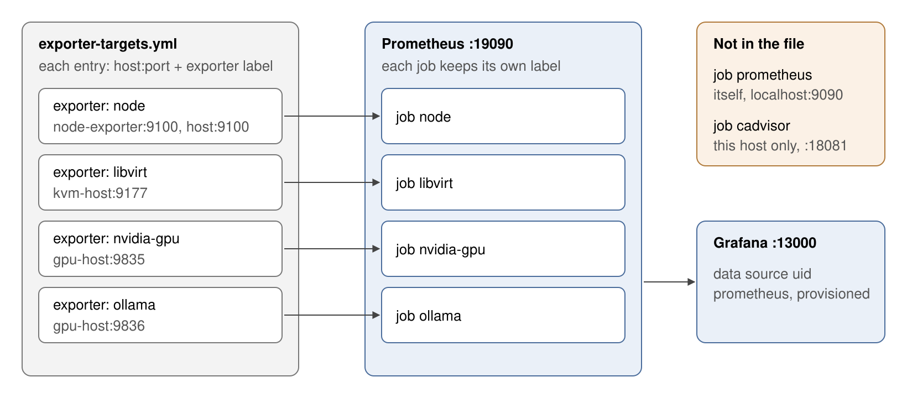
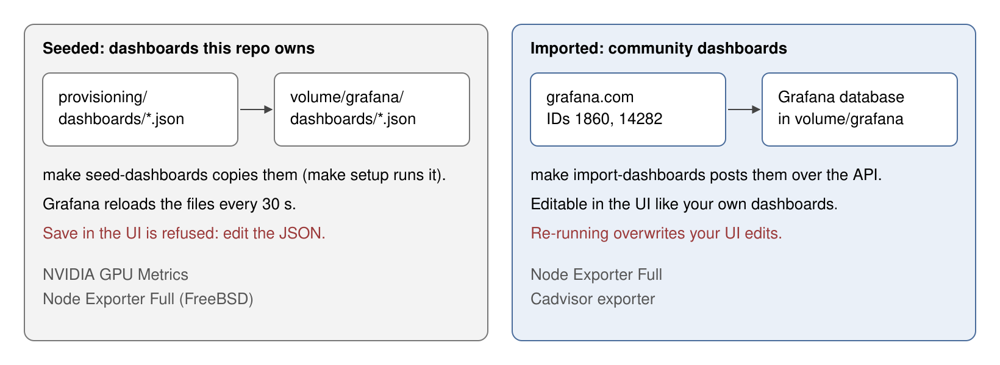
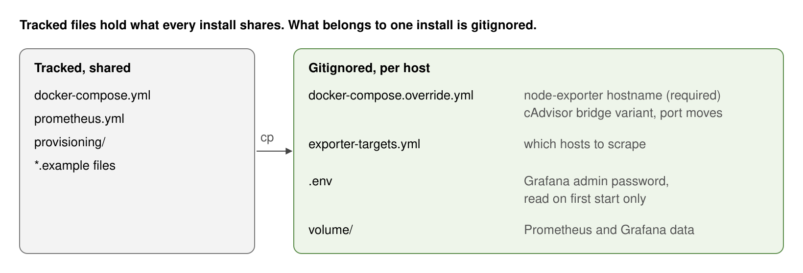

# Monitoring Stack

Prometheus and Grafana are the usual way to watch a few Linux, Docker and KVM hosts: exporters serve metrics, Prometheus scrapes them, and Grafana draws them. Here, though, the exporters are spread across several machines. Each GPU host runs its own GPU and Ollama exporters, the KVM host runs libvirt-exporter natively, and every physical host runs node_exporter. Hardcoding each address in `prometheus.yml` would put private hosts in git and mean editing tracked config every time a host joins. This directory runs one central Prometheus and Grafana, and reads every remote target from one gitignored file, `exporter-targets.yml`. A label on each entry routes it to the right job.

The host needs Docker with Compose v2, `make`, `sudo` for the volume permissions, and `python3` and `curl` for `make import-dashboards`.

```bash
cp .env.example .env                                   # set the Grafana admin password
cp exporter-targets.example.yml exporter-targets.yml   # list the hosts to scrape (point 1)
cp docker-compose.override.example.yml docker-compose.override.yml   # set hostname (point 3)
make setup               # create volume/ with the right owners, seed dashboards
make up
make import-dashboards   # needs Grafana running
```

Then open Grafana at http://localhost:13000 as `admin`, and Prometheus at http://localhost:19090.

## 1. Every remote exporter is a line in `exporter-targets.yml`, routed by its `exporter` label



The `node`, `libvirt`, `nvidia-gpu` and `ollama` jobs in `prometheus.yml` all read `exporter-targets.yml`. Each job keeps only the entries whose `exporter` label matches its name, then drops that label. Prometheus re-reads the file every 5 minutes, so adding a host needs no restart.

```yaml
- targets:
    - 'node-exporter:9100'   # this stack's own node-exporter, by compose service name
  labels:
    instance: '<host-name>'
    exporter: 'node'
```

| `exporter` label | Default port | Exporter |
|------------------|--------------|----------|
| `node` | 9100 | this stack's `node-exporter`, or `../host-exporters/` on another host |
| `libvirt` | 9177 | libvirt-exporter on the KVM host |
| `nvidia-gpu` | 9835 | `../gpu-exporter/` |
| `ollama` | 9836 | `../ollama-exporter/` |

`exporter-targets.example.yml` has entries for `nvidia-gpu` and `ollama` only. Add `node` and `libvirt` entries yourself. Without a `node` entry, the stack doesn't scrape even its own node-exporter.

Two jobs don't use the file. `prometheus` scrapes Prometheus itself. `cadvisor` scrapes only this host's cAdvisor, at `host.docker.internal:18081`. The cAdvisor in `../host-exporters/` has no scrape job.

Grafana gets its Prometheus data source from `provisioning/datasources/prometheus.yml`, with the fixed uid `prometheus`, so you don't add one by hand.

## 2. Dashboards arrive by two paths: seeded or imported



| Path | Command | Stored in | Edit it |
|------|---------|-----------|---------|
| Seeded | `make seed-dashboards`, run by `make setup` | `volume/grafana/dashboards/*.json` | Edit the JSON file. Grafana reloads it within 30 seconds and refuses Save in the UI. |
| Imported | `make import-dashboards` | Grafana's database in `volume/grafana` | In the UI. Re-running the import overwrites your edits, so use Save As to keep them. |

Seed the dashboards this repo owns. Their sources are in `provisioning/dashboards/`:

- NVIDIA GPU Metrics (`nvidia-gpu.json`), with Host and GPU pickers.
- Node Exporter Full (FreeBSD) (`opnsense.json`), for the OPNsense router.

Import the community dashboards you expect to tweak. The IDs are in the `DASHBOARDS` array of `import-dashboards.sh`:

- Node Exporter Full, ID `1860`.
- Cadvisor exporter, ID `14282`.

Libvirt VMs (`libvirt-dashboard-v2.json`) is on neither path. Import it by hand in the Grafana UI.

## 3. Settings for one install live in gitignored files



The tracked files never hold a hostname, an address or a password. Those live in files that the repo's `.gitignore` excludes:

- `docker-compose.override.yml`: Compose merges it into `docker-compose.yml` on every `make up`. Set `hostname:` for `node-exporter`. Without it, `node_uname_info` reports the container ID, and the host picker in Node Exporter Full shows a hex string. The example also has a cAdvisor bridge-networking block for hosts where host networking fails, such as btrfs with the containerd snapshotter. There's also a block to move the Grafana and Prometheus ports.
- `exporter-targets.yml`: the hosts to scrape (point 1).
- `.env`: `GF_SECURITY_ADMIN_PASSWORD`. Grafana applies it only on the first start. After that, change the password in the UI.
- `volume/`: Prometheus data (30 days) and Grafana data, owned by UID 65534 and UID 472.

## Make targets

| Target | What it does |
|--------|--------------|
| `make setup` | Run `fix-permissions`, then `seed-dashboards` |
| `make up` | Start all services |
| `make down` | Stop all services |
| `make restart` | Restart all services |
| `make logs` | Follow the logs |
| `make ps` | Show service status |
| `make fix-permissions` | Create `volume/prometheus` and `volume/grafana` and set their owners (sudo) |
| `make seed-dashboards` | Copy `provisioning/dashboards/*.json` into the Grafana volume (sudo) |
| `make import-dashboards` | Import the community dashboards into a running Grafana |
| `make clean` | Stop services and delete `volume/prometheus` and `volume/grafana` |
| `make diagrams` | Render `docs/diagrams/*.svg` to `docs/diagrams/png/` |

## Troubleshooting

**`open /prometheus/queries.active: permission denied`**, or **`GF_PATHS_DATA='/var/lib/grafana' is not writable`**: the volume owners are wrong. Run `make fix-permissions`, then `make restart`.

**cAdvisor shows `unhealthy` but `/metrics` works**: `CADVISOR_HEALTHCHECK_URL` must use the port cAdvisor listens on inside its own network namespace. That's `18081` with host networking, and `8080` with the bridge block in the override example.

**`import-dashboards.sh` fails with HTTP 401 or 403**: the `.env` password differs from the one Grafana started with the first time.
